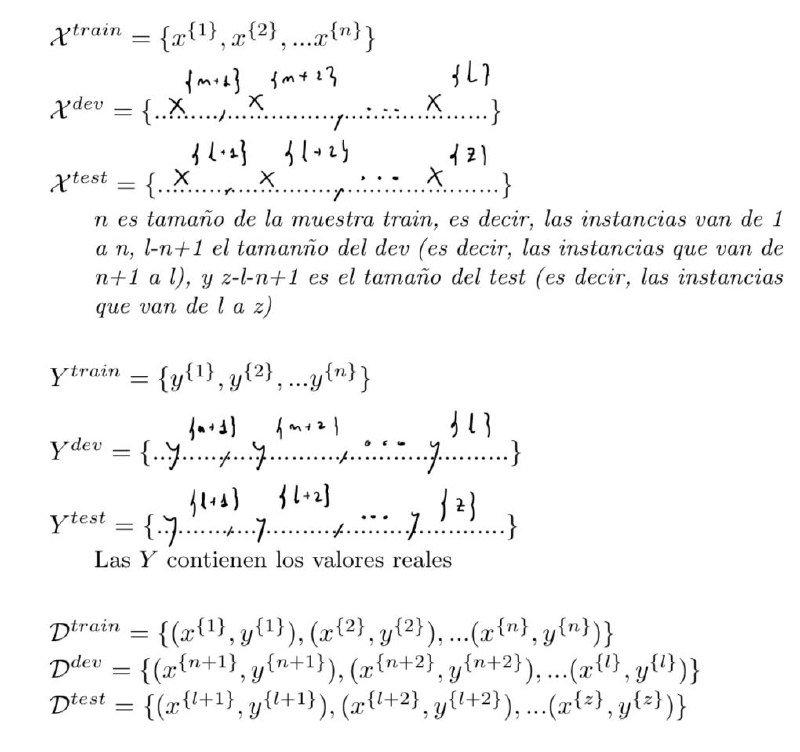

<!--markdownlint-disable-file MD029-->
# Examen Parcial - 2021-2022

## Explica

1. Dada siguiente formalización de los conjuntos de entrenamiento desarrolo y test para una tarea supervisada, rellena la parte

2. ¿En que consiste la evaluacion no honesta?

> Entrenar y evaluar con el mismo conjunto de datos

3. ¿Por que crees que cuando entrenamos varios modelos basados en distintos algoritmos donde para cada algoritmo tendremos que hacer un barrido de hiperparametros es necesario dividir los datos en train (entrenamiento), development (desarrollo) y finalmente test?¿Para que se emplea cada uno?

> Para conseguir que no haya overfitting y que el modelo sea capaz de generalizar. El conjunto de entrenamiento se emplea para entrenar el modelo, el conjunto de desarrollo se emplea para ajustar los hiperparametros y el conjunto de test se emplea para evaluar el modelo.

4. Identifica la mayor desventaja de un unico Arbol de Decision que se soluciona con el Random Forest y explica brevemente la razon por la que se soluciona con un Random Forest.

> El overfitting. Se soluciona con el Random Forest porque se entrena con distintos subconjuntos de datos y distintas variables.

5. ¿Cuales de los siguientes algoritmos funcionan solo con atributos numericos?

> kNN

## Ejercicios