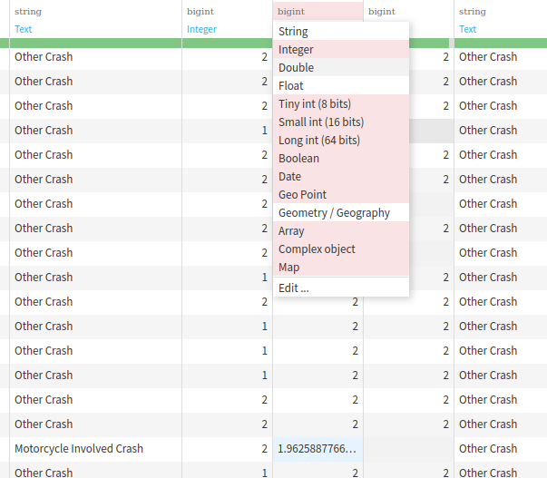

<!-- markdownlint-disable MD024 -->
# Practica 1

> [!NOTE]
> Esta es una guia que recoge varias cosas que hay que saber sobre Dataiku. Aunque sirva de ayuda no deberia de sustituir a la documentacion oficial ni los videotutoriales.

## Indice <!-- omit in toc -->

- [Practica 1](#practica-1)
  - [Crear un proyecto](#crear-un-proyecto)
  - [Importar un dataset](#importar-un-dataset)
  - [Preparar un dataset](#preparar-un-dataset)
    - [Analizar datos](#analizar-datos)
    - [Limpiar datos](#limpiar-datos)
    - [Rellenar valores vacios](#rellenar-valores-vacios)
    - [Escalar valores](#escalar-valores)
    - [Transformar valores categoricos a numericos](#transformar-valores-categoricos-a-numericos)
  - [Preguntas](#preguntas)

## Crear un proyecto

Para crear un proyecto en Dataiku iniciamos el servidor instalado localmente

```bash
./.dataiku/bin/dss start
```

o en un contenedor de Docker

```bash
docker run -p 11000:11000 -dit --name dataiku xabierland/dataiku-dss-11.3.2
```

Una vez iniciado el servidor, abrimos un navegador y vamos a la direccion [http://localhost:11000](http://localhost:11000). Nos pedira un usuario y contraseña, que por defecto es `admin` y `admin`. Una vez dentro, en la parte superior derecha, pulsamos en `+ Nuevo proyecto` y rellenamos los campos que nos pide.


## Importar un dataset

Una vez dentro del proyecto, en el centro, pulsamos en `+ Nuevo dataset` y seleccionamos `Subir archivo`. 


Seleccionamos el archivo Datos.csv y pulsamos en `Crear`.


Esto nos llevara a la pestaña de `Dataset` donde podremos ver el archivo que hemos subido.


## Preparar un dataset

### Analizar datos

#### Dataiku <!-- omit in toc -->

Dataiku permite mediante el click derecho en una columna, seleccionar `Analizar` y nos mostrara un grafico con la distribucion de los datos de la columna.


Por defecto, Dataiku nos muestra unicamente una parte de los datos, si queremos ver todos los datos, tendremos que seleccionar `Ver todos los valores` en la parte superior central.


De esta forma se cargara todo el conjunto de datos y podremos ver la distribucion de los datos de la columna.


Tambien podemos modificar la muestra de datos que queremos ver, seleccionando `Muestra` en la parte superior izquierda.


Todo esto, nos permite tener una vision general de los datos que estamos tratando y encontrar valores vacios, erroneos, atipicos... y poder tratarlos para que no afecten a los resultados de nuestros modelos.

### Limpiar datos

#### Dataiku <!-- omit in toc -->

Dataiku, dentro del menu `Actions` nos ofrece varias opciones para preparar un dataset. En este caso vamos a seleccionar `Preparar`.


Preparar un dataset nos lleva a una nueva pestaña donde podemos ver el dataset que hemos subido y realizar varias acciones sobre el.

### Rellenar valores vacios

#### Dataiku <!-- omit in toc -->

Dataiku, dentro del menu `Actions` nos ofrece varias opciones para preparar un dataset. En este caso vamos a seleccionar `Preparar`.


Preparar un dataset nos lleva a una nueva pestaña donde podemos ver el dataset que hemos subido y realizar varias acciones sobre el.

En este ejemplo vamos a movernos a la columna `A_PEDAL` y vamos a seleccionar `Rellenar valores vacios` lo que nos permitira rellenar los valores vacios de la columna con un valor que nosotros elijamos.


En este caso vamos a rellenar los valores vacios con la media de la columna.


Esto hara que Dataiku nos avise de que ahora, los datos, no son Integer, sino double por lo que tendremos que cambiar el tipo de dato de la columna.



#### Python/Recetas <!-- omit in toc -->

Dataiku, dentro del menu `Actions` nos ofrece varias opciones para preparar un dataset. En este caso vamos a seleccionar `Python`.


Ahora tendremos que crear el dataset que resultara de la ejecucion de la receta. Para ello seleccionamos `+ Nuevo dataset`, le ponemos un nombre y pulsamos en `Crear Dataset`.


Esto nos llevara a una nueva pestaña donde podremos ver el codigo de la receta. En este caso vamos a rellenar los valores vacios de la columna `A_PEDAL_F` con la media de la columna.

Este es el codigo que tendriamos que escribir.

```python
# -*- coding: utf-8 -*-
# Importamos librerias
import dataiku
import pandas as pd, numpy as np
from dataiku import pandasutils as pdu

# Nombres de los datasets
input_name = "Datos"
output_name = "Datos_output"

# Coge los datos del Dataset original
Datos = dataiku.Dataset(input_name)

# Crea un DataFrame con los datos del Dataset
Datos_df = Datos.get_dataframe()

# Rellenamos los valores vacios de la columna A_PEDAL con la media de la columna
"""
Funciones de pandas que se pueden usar para rellenar valores vacios
    x.mean() : Calcula la media de la columna
    x.median() : Calcula la mediana de la columna
    x.sum() : Suma los valores de la columna
    x.std() : Calcula la desviacion estandar de la columna
    x.var() : Calcula la varianza de la columna
    x.min() : Calcula el valor minimo de la columna
    x.max() : Calcula el valor maximo de la columna
    x.prod() : Calcula el producto de los valores de la columna
"""
Datos_df['A_PEDAL_F'] = Datos_df.groupby('A_PEDAL_FORMAT')['A_PEDAL_F'].transform(lambda x: x.fillna(x.mean())).apply('int64')

# Escribimos el DataFrame en el Dataset de salida
Datos_output = dataiku.Dataset(output_name)
Datos_output.write_with_schema(Datos_df)
```

### Escalar valores

#### Dataiku <!-- omit in toc -->

#### Python/Recetas <!-- omit in toc -->

Dataiku, dentro del menu `Actions` nos ofrece varias opciones para preparar un dataset. En este caso vamos a seleccionar `Python`.


Ahora tendremos que crear el dataset que resultara de la ejecucion de la receta. Para ello seleccionamos `+ Nuevo dataset`, le ponemos un nombre y pulsamos en `Crear Dataset`.


```python
# -*- coding: utf-8 -*-
# Importamos librerias
import dataiku
import pandas as pd, numpy as np
from dataiku import pandasutils as pdu

# Funciones para escalar valores

def min_max_scaler(x):
    return (x - x.min()) / (x.max() - x.min())

def maximum_abs_scaler(x):
    return x / x.abs().max()

def z_score_scaler(x):
    return (x - x.mean()) / x.std()

# Nombres de los datasets
input_name = "Datos"
output_name = "Datos_output"

# Coge los datos del Dataset original
Datos = dataiku.Dataset(input_name)

# Crea un DataFrame con los datos del Dataset
Datos_df = Datos.get_dataframe()

# Escalaremos los valores de la columna especificada o de todas las columnas
columna = 'COLUMN_NAME'
#columna = Datos_df.keys()

Datos_df[columna] = maximum_abs_scaler(Datos_df[columna])

# Escribimos el DataFrame en el Dataset de salida
Datos_output = dataiku.Dataset(output_name)
Datos_output.write_with_schema(Datos_df)
```

### Transformar valores categoricos a numericos

#### Dataiku <!-- omit in toc -->

Dataiku, dentro del menu `Actions` nos ofrece varias opciones para preparar un dataset. En este caso vamos a seleccionar `Preparar`.


Preparar un dataset nos lleva a una nueva pestaña donde podemos ver el dataset que hemos subido y realizar varias acciones sobre el.

En este ejemplo, vamos a seleccionar movernos a la columna `A_TOD_FORMAT` y seleccionar `Encontrar y reemplazar`.


Esto nos permitira reemplazar los valores de la columna por otros valores que nosotros elijamos.


#### Python/Recetas <!-- omit in toc -->

Dataiku, dentro del menu `Actions` nos ofrece varias opciones para preparar un dataset. En este caso vamos a seleccionar `Python`.


Ahora tendremos que crear el dataset que resultara de la ejecucion de la receta. Para ello seleccionamos `+ Nuevo dataset`, le ponemos un nombre y pulsamos en `Crear Dataset`.


```python
# -*- coding: utf-8 -*-
# Importamos librerias
import dataiku
import pandas as pd, numpy as np
from dataiku import pandasutils as pdu

# Nombres de los datasets
input_name = "Datos"
output_name = "Datos_output"

# Coge los datos del Dataset original
Datos = dataiku.Dataset(input_name)

# Crea un DataFrame con los datos del Dataset
Datos_df = Datos.get_dataframe()

# Transformamos los valores categoricos a numericos de la columna especificada o de todas las columnas
#columna = 'COLUMN_NAME'
columna = Datos_df.keys()

Datos_df[columna] = Datos_df[columna].apply(lambda x:pd.factorize(x)[0])

# Escribimos el DataFrame en el Dataset de salida
Datos_output = dataiku.Dataset(output_name)
Datos_output.write_with_schema(Datos_df)
```

## Preguntas
