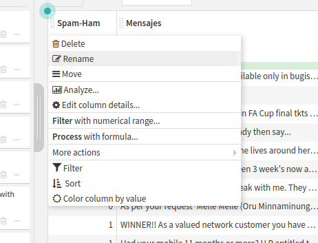
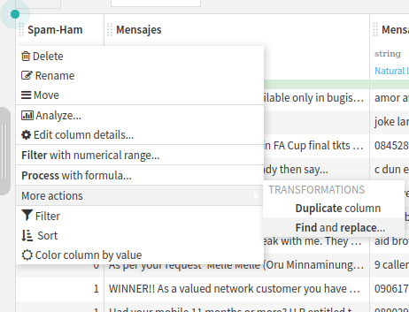
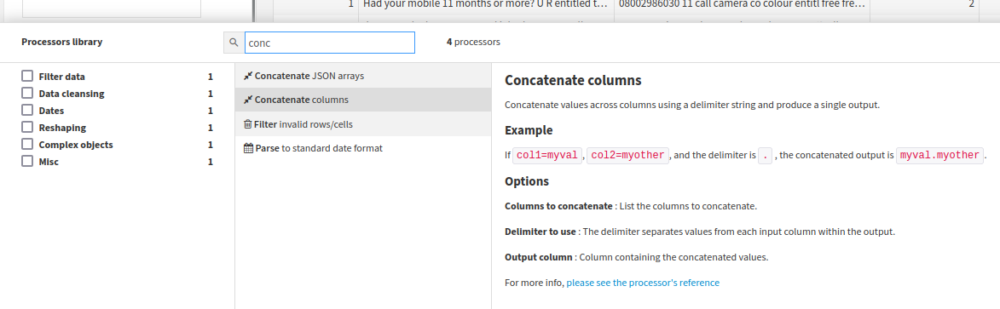
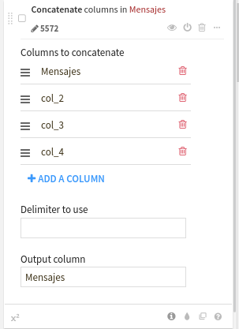

<!-- markdownlint-disable MD024 -->
# Practica 1

- [Practica 1](#practica-1)
  - [Tarea 1 - Visualizacion de video sobre preprocesado de datos textuales](#tarea-1---visualizacion-de-video-sobre-preprocesado-de-datos-textuales)
    - [Tutorial](#tutorial)
    - [Preguntas - Video 1](#preguntas---video-1)
    - [Preguntas - Video 2](#preguntas---video-2)
  - [Tarea 2 - Nueva tarea de clasificacion sobre mensajes de eMail](#tarea-2---nueva-tarea-de-clasificacion-sobre-mensajes-de-email)
    - [Tutorial](#tutorial-1)
    - [Preguntas](#preguntas)

## Tarea 1 - Visualizacion de video sobre preprocesado de datos textuales

### Tutorial

#### Importar el dataset <!-- omit in toc -->

El primer paso es importar el dataset a Dataiku. Para ello, hacemos click en el boton `+` que se encuentra en la parte superior izquierda de la pantalla y seleccionamos `Import dataset`. A continuacion, seleccionamos el archivo que queremos importar y hacemos click en `Import`. Una vez importado, podemos ver el dataset en la pestaña `Datasets` de la barra lateral izquierda.

#### Analizar el dataset <!-- omit in toc -->

Lo primero que vemos una vez importado el Dataset es, una primera columna que nos indica si es spam o no es spam. A continuacion, tenemos el mensaje de texto el cual por problemas en el csv se ha dividido en varias columnas. Viendo esto, nos queda claro que la primera columna debemos transformarla de numerico a categorico y juntar las columnas de texto en una sola.

#### Preparar el dataset <!-- omit in toc -->

Hacemos click en `Actions` y seleccionamos `Prepare`.

1. Renombramos la columna `v1` a `ìs_spam` y la columna `v2` a `message`. 
2. Convertimos la columna `is_spam` a categorica. 
3. Concatenamos las columnas `message` en una sola.  
4. Borramos las columnas sobrantes. 
5. Simplificamos el texto.  
6. Creamos una columna con la longitud del mensaje. 
7. Contamos el numero de apariciones de la palabra `free` en el mensaje. 

#### Entrenar el modelo <!-- omit in toc -->

Para empezar a entrenar nuestro modelo de prediccion de spam, hacemos click sobre la columna `is_spam` y seleccionamos `Create prediction model` y seleccionamos `Quick Prototypes` 

### Preguntas - Video 1

#### Pregunta 1 - Emparejar los terminos con su definicion <!-- omit in toc -->

| Termino | Definicion |
| ------- | ---------- |
| Normalizar | Convertir el texto a minusculas, eliminar las tildes y convertir el texto a Unicode |
| Lematizar |  Quedarse con la raiz de las palabras, Por ejemplo, crecer crec |
| Eliminar stop words | Eliminar del texto las palabras de semántica ligera, es decir, palabras con poco contenido semántico que no representan conceptos concretos. Ejemplos pueden ser las preposiciones, artículos, etc |

#### Pregunta 2 - ¿Cuales son ciertas? <!-- omit in toc -->

Hashing y Bag Of Words son iguales porque no son más que dos formas de llamar a una vectorización.

> Falso, son dos formas de vectorizar pero no son iguales.

BOW: los tokens (palabras o lemas de palabras)individuales se extraen y se obtiene su frecuencia en el texto a convertir. Por otro lado, cada palabra dentro del conjunto de datos obtiene un identificador único construyendose así un diccionario o vocabulario. Entonces, cualquier texto (por ejemplo un mensaje de SMS) que veamos puede codificarse como un vector de longitud fija (la longitud del vocabulario obtenido a partir del conjunto de datos) donde en cada posición en el vector se almacenaría la frecuencia de cada palabra en el texto (mensaje SMS). Se puede emplear en CountVectorizer.

> Verdadero, es una forma de vectorizar.

#### Pregunta 3 - ¿En qué consiste la simplificacion que nos propone DSS? <!-- omit in toc -->

[X] En normalizar el texto pasarlo a minúsculas, eliminar los signos de puntuación, lematizarlo y eliminar las stop words.

[ ] En convertilos en más simple.

#### Pregunta 4 - Responde si las siguientes afirmaciones son ciertas <!-- omit in toc -->

La representación por BOW presenta el problema de generar vectores muy dispersos donde hay muchos ceros.

> Verdadero, el vector tendrá tantos elementos como palabras contega el vocabulario representativo de todo el conjunto de datos.

### Preguntas - Video 2

#### Pregunta 1 - ¿Cuales de las siguientes afirmaciones son ciertas? <!-- omit in toc -->

Hashing y Bag Of Words son iguales porque no son más que dos formas de llamar a una vectorización.

> Falso, son dos formas de vectorizar pero no son iguales.

BOW: los tokens (palabras o lemas de palabras)individuales se extraen y se obtiene su frecuencia en el texto a convertir. Por otro lado, cada palabra dentro del conjunto de datos obtiene un identificador único construyendose así un diccionario o vocabulario. Entonces, cualquier texto (por ejemplo un mensaje de SMS) que veamos puede codificarse como un vector de longitud fija (la longitud del vocabulario obtenido a partir del conjunto de datos) donde en cada posición en el vector se almacenaría la frecuencia de cada palabra en el texto (mensaje SMS). Se puede emplear en CountVectorizer.

> Verdadero

Hashing: Emplear un hash unidireccional de palabras para convertir los tokens (palabras o lemas) en números enteros a través de algún algoritmo codificador (por ejemplo Murmurhash3). Esto no requiere de vocabulario y puede elegir un vector de longitud fijo de longuitud arbitraria. Una deventaja es que el hash es una función unidireccional, por lo que no hay forma de volver a convertir la codificación en una palabra.

> Verdadero

#### Pregunta 2 - Response si la siguientes afirmaciones son ciertas <!-- omit in toc -->

#### Pregunta 3 <!-- omit in toc -->

#### Pregunta 4 <!-- omit in toc -->

## Tarea 2 - Nueva tarea de clasificacion sobre mensajes de eMail

### Tutorial

### Preguntas

#### Pregunta 1 <!-- omit in toc -->

#### Pregunta 2 <!-- omit in toc -->
