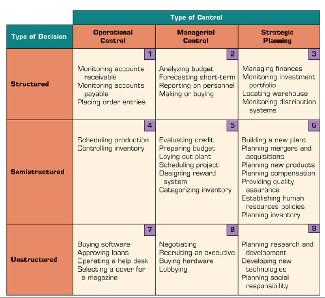

# Tema 1

## Indice

- [Tema 1](#tema-1)
  - [Indice](#indice)
  - [Objetivos](#objetivos)
  - [El Proceso de la Toma de Decisiones](#el-proceso-de-la-toma-de-decisiones)
  - [Problemas en la recopilación de datos](#problemas-en-la-recopilación-de-datos)
  - [Caracterización de los diferentes tipos de decisiones](#caracterización-de-los-diferentes-tipos-de-decisiones)
  - [Cambios originados por Tecnología](#cambios-originados-por-tecnología)

## Objetivos

- Entender la importancia de los datos y del rol del cientifico de datos
- Reconocer las fases del proceso de toma de decisiones
- Conocer los metodos para identificar problemas y tomar decisiones
- Caracterizar los diferentes tipos de decisiones
- Conocer la matriz de la toma de decisiones
- Conocer los cambios que se producen por la tecnologia

## El Proceso de la Toma de Decisiones

- Las empresas son complejas y cambiantes
- Buscan agilidad en la toma de decisiones
  - Necesitan muchos datos para esto
- Se crean modelos de datos para la toma de decisiones con unas fases en comun:
  - Identificacion del problema
    - Identificar los aparentes problemas
    - Buscar y analizar la causa
    - Definir el problema real
  - Toma de decisiones
    - Identificar las diferentes soluciones
    - Elegir la mejor solucion
  - Planificar y organizar
    - Realizar un plan de accion
    - Implementar el plan

## Problemas en la recopilación de datos

- Datos no estructurados
- Datos no confiables
- Datos no actualizados
- Datos no relevantes
- Datos no accesibles
- Datos no seguros
- Datos no integrados
- Datos no escalables
- Datos no analizables
- Datos no interpretables
- Datos no accionables
- Datos no sostenibles
- Datos no éticos
- Datos no legales
- Datos no sencillos

## Caracterización de los diferentes tipos de decisiones

## Cambios originados por Tecnología

- Comunicación y colaboracion en grupo
- Gestion de datos mejorada
- Big Data
- Soporte analitico
- Superacion de los limites cognitivos en el procesamiento y almacenamiento de datos
- Mejor conocimiento Interno
- Soporte en cualquier lugar y en cualquier momento