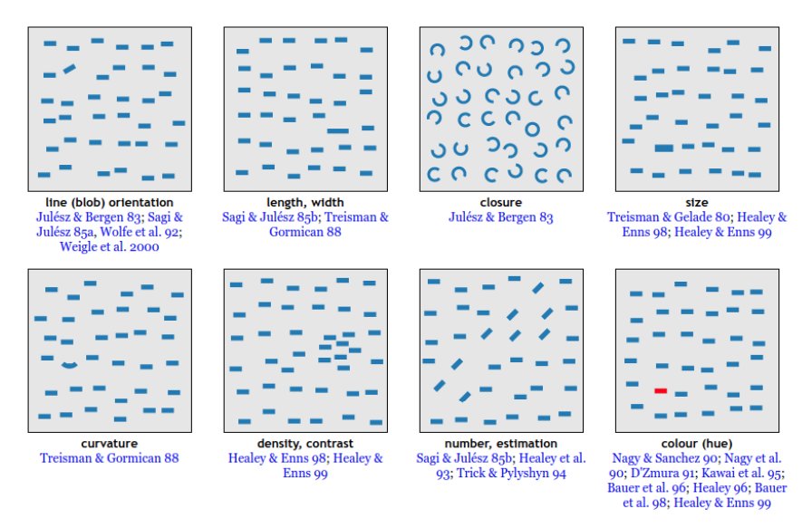
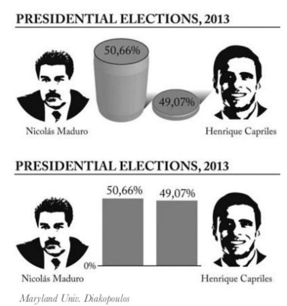

<!-- markdownlint-disable MD025 -->

# Tema 7 <!-- omit in toc -->

- [Introducción](#introducción)
- [Presentación de datos](#presentación-de-datos)
- [Tipos de datos y sus gráficos](#tipos-de-datos-y-sus-gráficos)
- [Cuadros de mando](#cuadros-de-mando)

# Introducción

La visualización de datos permite ver patrones, tendencias y correlaciones que de otra manera serían difíciles de detectar. 
La visualización de datos es una parte esencial de la ciencia de datos y del análisis de datos.

El proceso de trabajar los datos es:

1. Nos planteamos una pregunta.
2. Obtenemos los datos para dar respuesta a la pregunta.
3. Transformamos (limpiamos) los datos.
4. Visualizamos los datos.
5. Obtenemos respuestas a la pregunta.
6. Ponemos en valor los resultados.

El cerebro humano es muy bueno en el procesamiento de información visual.
Es por esto que al hacerlo somos capaces de trasmitir información de manera más efectiva y de que la información se retenga mejor.

# Presentación de datos

A la hora de presentar los datos, es importante tener claro que atributos debemos destacar y de que forma hacerlo.

- Tamaño
- Color
- Orientación
- Forma
- Intensidad
- Encuadrado
- Posición

Jugar con estos atributos nos permitirá destacar la información que queremos transmitir.

En muchos casos, esto tambien se usa para "amañar" los datos y hacer que estos se vean de una forma que nos interesa.

- Cambiar la escala de los ejes
- Cambiar el tipo de gráfico (Hay gráficos que pueden hacer que los datos se vean de una forma que no es real)
- Mostrar la información desordenada

# Tipos de datos y sus gráficos

Los tipos de datos son:

- Cuantitativos
  - Discretos
    - Números enteros
  - Continuos
    - Números decimales
- Cualitativos
  - Ordinales
    - Categorías con un orden
  - Nominales
    - Categorías sin un orden

Cada tipo de dato tiene un tipo de gráfico que se ajusta mejor a él.

- Cuantitativos
  - Discretos
    - Diagrama de barras
    - Histograma
  - Continuos
    - Diagrama de líneas
    - Diagrama de cajas
- Cualitativos
  - Ordinales
    - Diagrama de barras
    - Diagrama de líneas
  - Nominales
    - Diagrama de barras
    - Diagrama de pastel

# Cuadros de mando

Es difícil que un solo gráfico nos de toda la información que necesitamos.
Para ello, se suelen usar cuadros de mando, que son una colección de gráficos que nos permiten ver la información de una forma más completa.
Por ejemplo: `Tableau, Power BI, Google Data Studio, etc.`